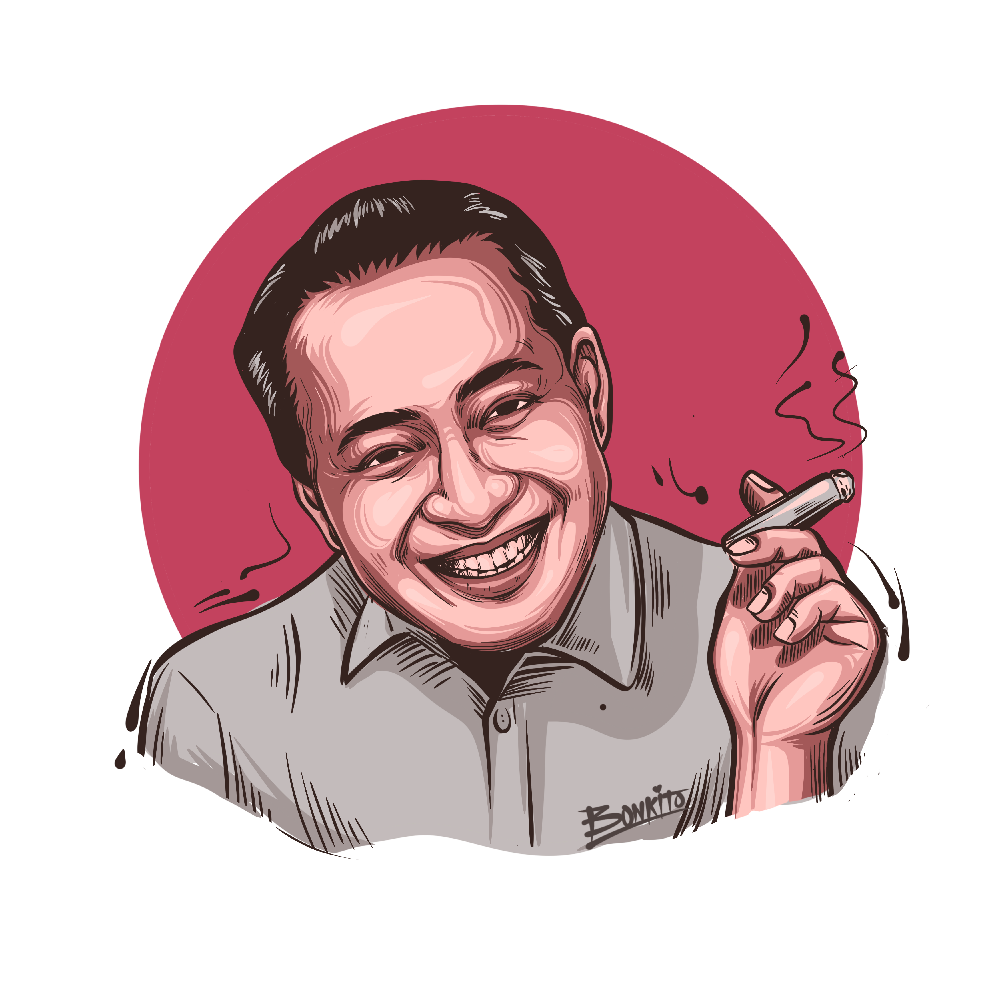
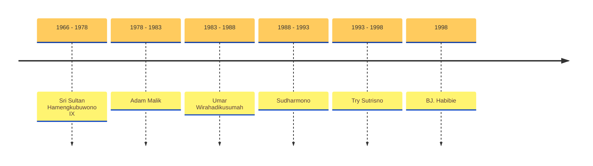

# OrdeBaru

<v-clicks>

- Orde Baru adalah satu periode dalam sejarah Indonesia yang berawal dengan naiknya Soeharto sebagai Presiden Indonesia pada 1966 sampai lengsernya pada 1998.
- Ditandai dengan terbitnya Surat Perintah Sebelas Maret (Supersemar) pada tahun 1966, Orde Baru resmi berdiri.
- Bentuk pemerintahan: Kesatuan
- Bentuk Negara: republik
- Sistem Pemerintahan: Presidential
- Sistem Konstitusi: UUD 1945

</v-clicks>

---
color: white
layout: cover
transition: fade

---

# The Smiling General

<v-click>

  

</v-click>
<v-click>

</v-click>

