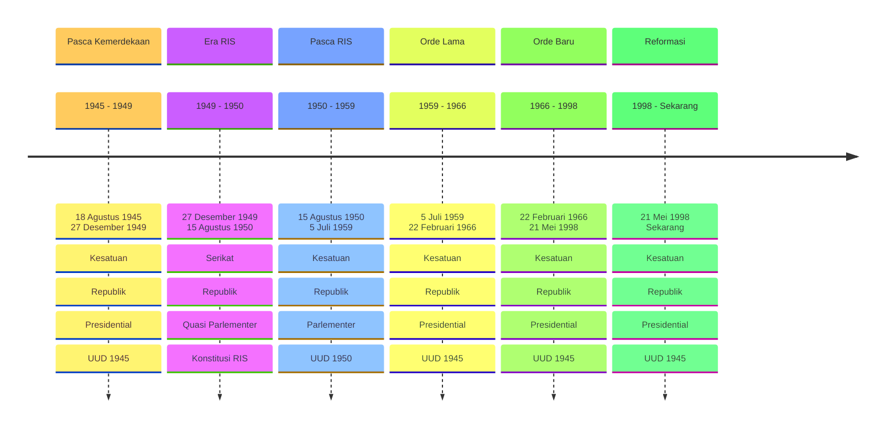

# Timeline Sejarah

```mermaid
%%{init: {'theme': 'base', 'logLevel': 'debug', 'timeline': {'disableMulticolor': true}}}%%
timeline
section Pasca Kemerdekaan
  1945 - 1949
      : 18 Agustus 1945 <br> 27 Desember 1949
      : Kesatuan
      : Republik
      : Presidential
      : UUD 1945
section Era RIS
  1949 - 1950
      : 27 Desember 1949 <br> 15 Agustus 1950
      : Serikat
      : Republik
      : Quasi Parlementer
      : Konstitusi RIS
section Pasca RIS
  1950 - 1959
      : 15 Agustus 1950 <br> 5 Juli 1959
      : Kesatuan
      : Republik
      : Parlementer
      : UUD 1950
section Orde Lama
  1959 - 1966
      : 5 Juli 1959 <br> 22 Februari 1966
      : Kesatuan
      : Republik
      : Presidential
      : UUD 1945
section Orde Baru
  1966 - 1998
      : 22 Februari 1966 <br> 21 Mei 1998
      : Kesatuan
      : Republik
      : Presidential
      : UUD 1945
section Reformasi
  1998 - Sekarang
      : 21 Mei 1998 <br> Sekarang
      : Kesatuan
      : Republik
      : Presidential
      : UUD 1945
```

