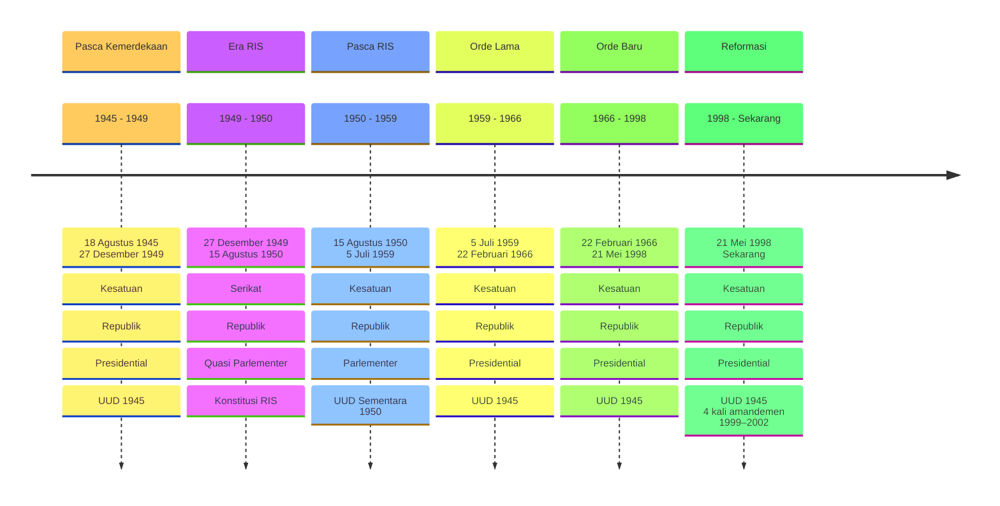

# Sistem Pemerintahan Indonesia  Dari Masa ke Masa

  Lets Start The Journey <carbon:arrow-right class="transition-transform duration-300 hover:translate-x-2" />

<!-- Footer -->

  

    

      
      <h3 class="font-medium text-sm">Universitas NusaPutra</h3>
    

    

      
Mata Kuliah

      
Pendidikan Kewarganegaraan

    

    

      
Dosen Pembimbing

      
Dr. WATI SOLIHAT SUKMAWATI, M.Pd

    

    

      

      <carbon:user-avatar class="inline-block" />
        Ahmad Hasan Maki
        20240040032
      

      

      <carbon:user-avatar class="inline-block" />
        Fauzan Nurpadilah
        20240040041
      

      

      <carbon:user-avatar class="inline-block" />
        Rivaldi Akmal Fauzan
        20240040030
      

    

  

---
layout: cover
background: /img/slide-timeline.jpg
class: 'text-white text-center px-20'
transition: slide-up
---

# Sejarah Sistem Pemerintahan Indonesia

